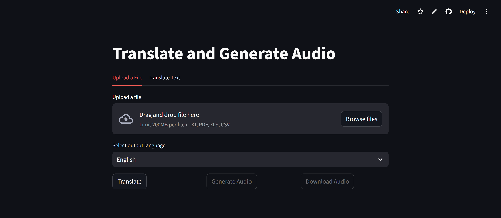
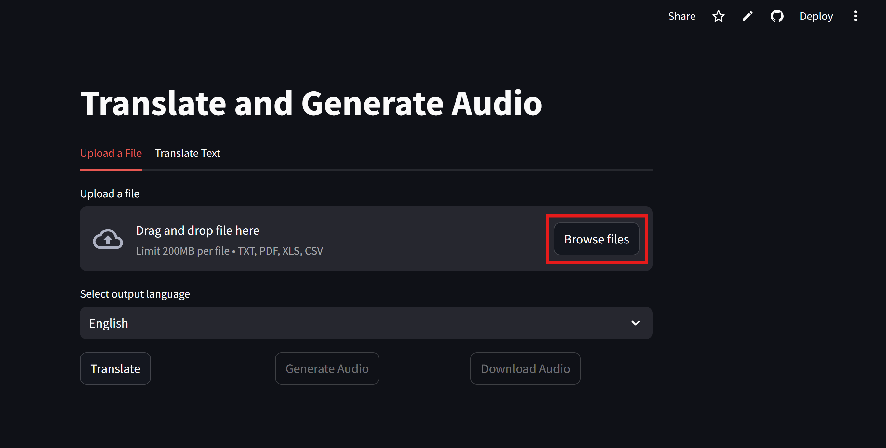
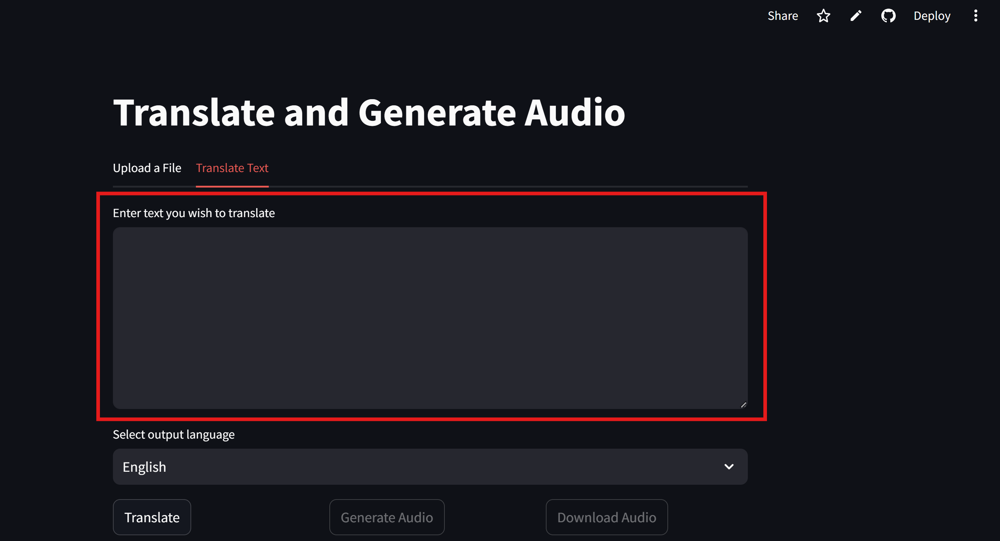
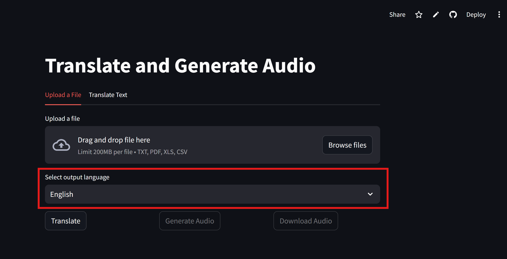
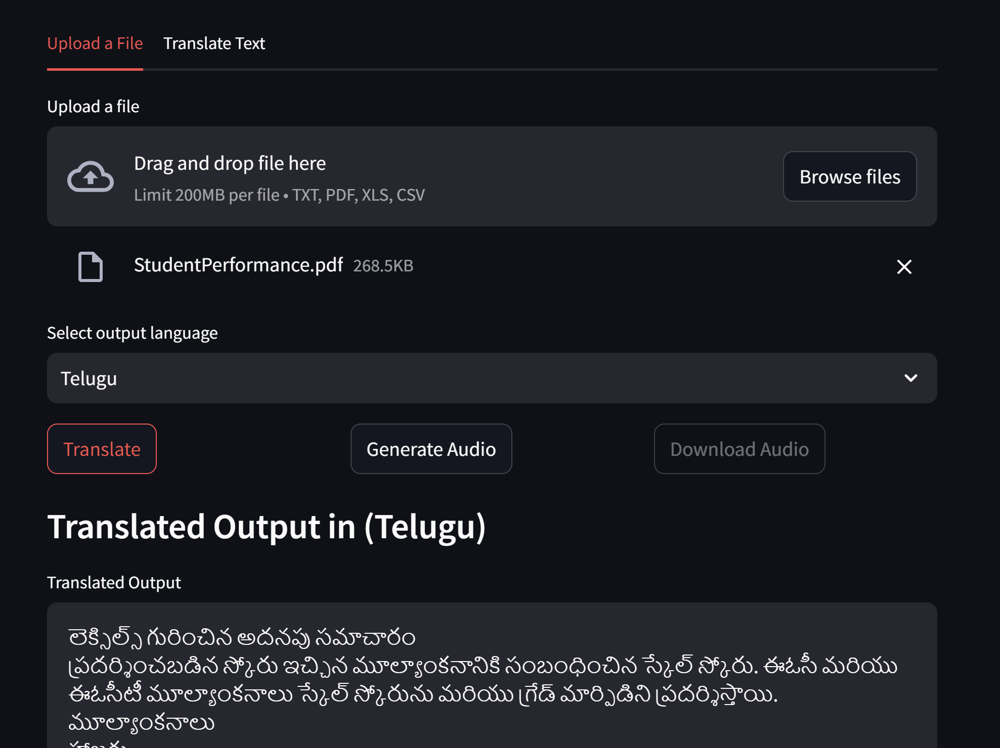
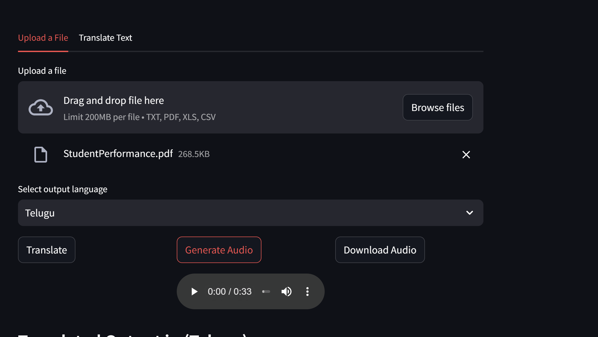

# Capstone-Project
Edureka Capstone Project

# Translator + Audio Generator

A Streamlit application that translates text or uploaded documents into another language and generates audio in MP3 format.

## Project Overview

This app allows users to:
- Enter text manually,
- Upload supported files (`txt`, `pdf`, `csv`, `xls`),
- Translate the text to a selected target language,
- Generate audio from the translated text,
- Download the resulting MP3 audio

## Features

- Translate text typed directly into the app
- Extract and translate text from uploaded files
- Generate audio from translated text using `gTTS`
- Download generated audio as an MP3 file
- Support for multiple output languages

## Supported Languages

- English
- Spanish
- French
- German
- Hindi
- Telugu
- Tamil
- Chinese
- Japanese
- Korean

## Supported File Types

- `txt`
- `pdf`
- `csv`
- `xls`

## Prerequisites

- Python 3.8 or higher
- `pip`

## Installation

1. Open a terminal in the project folder:
   
   cd "Capstone_Project"

2. Create and activate a virtual environment:
   
    Windows:

       python -m venv .venv
       .venv\Scripts\activate

    macOS/Linux:

       python -m venv .venv
       source .venv/bin/activate

4. Install the dependencies:

         pip install -r requirements.txt


## Setting Up the Gemini API Key

This application requires a Google Gemini API key to perform text translation operations.

1.  Get Your API Key

      - Go to: https://ai.google.dev

      - Sign in with your Google account

      - Create a new API key

      - Copy the key

2.  Set your Gemini API key as an environment variable:

   - **For Windows (PowerShell)**

         setx GEMINI_API_KEY "your_api_key_here"

   - **For macOS / Linux**

         export GEMINI_API_KEY="your_api_key_here"

   - If you using Streamlit secrets in the code, you can also configure GEMINI_API_KEY using the following steps:

      1. Create a folder with name **.streamlit** in the root folder
      2. Create a file named **secrets.toml** inside .streamlit folder
      3. Use the created gemini API key in the secrets.toml file as below
      
               GEMINI_API_KEY = "your_api_key_here"

3.  Verify the Key

      The app checks for the API key at startup.
      If the key is missing or invalid, you will see an error message in the UI.

## Running the App

- Start the Streamlit application using below command in the terminal:

   **streamlit run app/frontend/app.py**

- Confirm the UI Loads
  <p align="center">
  
</p>

  You should see:
  - Text translation tab
  - File upload tab
  - Browse Files button  
  - Language dropdown
  - Active Translate button
  - Disabled Generate audio button 
  - Disabled Download audio button 

## Usage

1. Open the Streamlit app in your browser.
   
   Working public URL: https://capstone-project-cyqesmecxmwzkbv8tv3capp.streamlit.app/
   
2. Choose one tab:

   - **Upload a File** to translate text from a file. 

     - If using **Upload a File** tab , click "Browse Files" button to select the file for translation and skip to next step 3
      
<p align="center">
  
</p> 
   
   - **Translate Text** to enter text manually.
         
      - If using **Translate Text**, enter text in the "Enter text you wish to translate" area and skip to next step 3
   
<p align="center">
  
</p>
 
3. Select the target output language from the ' Select Output Language' drop-down menu

<p align="center">
  
</p>
4. Click **Translate**.
 
<p align="center">
  
</p>

5. After translation completes, click **Generate Audio**.

<p align="center">
  
</p>

6. Download the MP3 audio by clicking **Download Audio**.
 <p align="center">
  
</p>

## Project Structure
```  
Capstone_Project/
│
├── frontend/                      # All Streamlit UI + interaction layer
│   │
│   ├── app.py                     # Main Streamlit application
│   │
│   ├── tabs/                      # UI tabs for Streamlit
│   │   ├── file_upload_tab.py     # File upload + extraction + translation UI
│   │   └── text_translate_tab.py  # Text input + translation UI
│   │
│   └── buttons/                   # Button logic (translate + audio)
│       ├── translate_button.py
│       └── generate_audio_button.py
│
├── api/                           # External API clients
│   └── gemini_client.py           # Gemini API client setup
│
├── config/                        # Configuration files (constants, mappings)
│   └── languages.py               # Language code mappings
│
├── services/                      # Backend logic (no Streamlit)
│   ├── translation_service.py     # Uses gemini_client for translation
│   ├── text_to_speech.py          # gTTS audio generation
│   ├── text_extraction_service.py # PDF/CSV/Excel extraction
│
├── utils/                         # Helper utilities
│   ├── pdf_utils.py               # PDF parsing helpers
│   ├── excel_utils.py             # Excel parsing helpers
│   └── csv_utils.py               # CSV parsing helpers
│
├── requirements.txt               # Python dependencies
├── README.md                      # High-level project overview
└── Documentation.md               # Detailed technical documentation

```  

## Internal Architecture (Quick Overview)

- Frontend → UI tabs + buttons
- Services → translation, extraction, audio
- API → Gemini client
- Utils → file parsing helpers


## Technologies Used

- Python
- Streamlit
- Gemini API
- gTTS 
- PyPDF2
- Pandas
- OpenPyXL
- CSV utilities

## Error Handling

The app includes:

* API key validation

* File type validation

* Empty input warnings

* Exception handling for API failures

* User‑friendly messages

## Considerations
**API Key Security**
* Never hard‑code your API key in the code

* Use environment variables

* Do not commit your key to GitHub
 

## File Size
* Large PDFs or Excel files may take longer to process

* Streamlit has upload size limits

## Language Support
* Translation quality depends on Gemini’s language capabilities

* Some languages may have limited TTS support

## Internet Requirement
Gemini API calls require an active internet connection

## Limitations
- No offline translation or TTS

- No batch translation for multiple files at once

- TTS output is limited to MP3 format

- PDF extraction may struggle with scanned documents

- CSV/Excel extraction assumes readable text content

- Translation accuracy depends on chosen Gemini model.

## Challenges Faced During Development

1. Handling Multiple File Types
   Extracting text from:
   PDFs
   CSVs
   Excel files
   Required separate parsing logic and error handling.

2. Managing Session State
   Streamlit session state needed careful handling to:

  - Store extracted text
  - Store translated text
  - Store audio bytes
  - Avoid losing data between button clicks

3. Managing Streamlit widget keys:
  - Multiple tabs and repeated widgets required unique keys
  - Without keys, widgets conflicted or overwrote session state
  - Assigning keys ensured stable UI behavior and correct state updates


4. Gemini API Response Handling
   Ensuring:
  - Correct prompt formatting
  - Safe error handling
  - Stable API client initialization

## Deployment
This application is deployed on Streamlit Cloud.
Any push to the main branch automatically triggers a redeployment.

**Python Version**
The Python version used by Streamlit Cloud is python-3.12. We can update it under the app settings.

**Dependencies**
All required Python packages are listed in requirements.txt.
Streamlit Cloud installs these automatically during deployment.

**Secrets (API Keys)**
Sensitive keys (e.g., Gemini API key) are not stored in the repository.
They must be added in the Streamlit Cloud dashboard:

1. Go to https://share.streamlit.io

2. Open your app

3. Go to Settings → Secrets

4. Add your key in TOML format:

GEMINI_API_KEY = "your-real-key-here"

**Automatic Redeployment**
Whenever you push changes to GitHub:

- Streamlit Cloud pulls the latest code

- Installs dependencies

- Applies the Python version from runtime.txt

- Loads secrets

- Restarts the app

Working public URL: https://capstone-project-cyqesmecxmwzkbv8tv3capp.streamlit.app/ 

No manual deployment commands are required.

**Note:** Due to limitations with free tier model, app can throw 429- Too many requests error.
